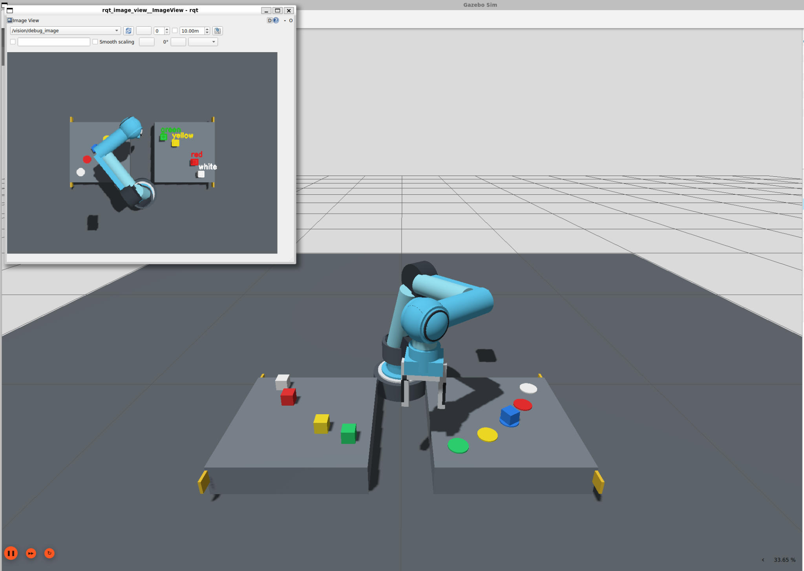

# Project Report

## C++ Vision-Guided 6-DOF Robot Arm: OpenCV Color Sorting and Pick-and-Place

## 1. Abstract

This project implements a standalone C++17 software system for six-degree-of-
freedom robot arm kinematics and joint-space trajectory planning. The system
includes a Denavit-Hartenberg robot model, homogeneous forward kinematics, an
analytical geometric Jacobian, damped least-squares inverse kinematics, joint
limits, quintic interpolation, automated numerical tests, and a multi-stage
pick-and-place demonstration.

The mathematical core uses no third-party runtime library. An optional ROS 2
Jazzy layer adds an `rclcpp` trajectory player, a matching URDF model, live
joint-state and end-effector topics, and RViz visualization. Numerical results
are exported to CSV, and trajectory plots are generated directly as SVG. In
the verified standalone demonstration, all seven inverse-kinematics targets
converged and all five automated tests passed.

Version 2.0 adds a Gazebo Harmonic experiment in which a two-finger gripper
must transport a dynamic cube through simulated contact and friction. The
experiment measures the final cube pose and publishes an explicit pass/fail
result rather than treating successful arm motion as successful manipulation.

Version 3.0 extends the experiment into a command-driven perception and
manipulation system. An overhead RGB camera observes five colored cubes,
a C++ OpenCV node confirms the requested color, and the controller moves the
selected dynamic object. The robot visuals were also redesigned with
industrial joint housings, metal link shells, actuator details, and rubber
gripper pads while retaining the validated kinematics and collision model.

Version 3.1 separates arm and gripper trajectory controllers, introduces a
validated C++ color-command utility, corrects Gazebo model-pose selection, and
adds an explicit post-lift grasp-retention test. This prevents successful arm
motion from being reported as successful object manipulation.

Version 5 extends the system into a stable two-table, five-color sorting workcell with color-specific source and transfer profiles, improved motion clearance, low destination release, safe return-home behavior, and verified sequential command execution.

## 2. Objectives

The objectives are:

1. Implement a reusable six-axis serial manipulator model in modern C++.
2. Calculate tool position and orientation from joint variables.
3. Derive the manipulator geometric Jacobian.
4. Solve reachable pose targets numerically while enforcing joint limits.
5. Generate smooth multi-segment joint trajectories.
6. Validate the mathematical implementation with automated tests.
7. Export reproducible metrics and visual results.
8. Integrate the same algorithms with ROS 2 Jazzy and RViz.
9. Evaluate object transport in a rigid-body physics simulation.
10. Detect and select white, red, blue, yellow, and green targets from RGB data.
11. Connect a user color command to perception, motion, and result verification.

## 3. Software architecture

| Component | Responsibility |
| --- | --- |
| `robot_math` | Fixed-size vectors, matrices, transformations, rotation logarithm, and linear solver |
| `robot_model` | DH parameters, forward kinematics, Jacobian, poses, and joint limits |
| `inverse_kinematics` | Damped least-squares numerical IK |
| `trajectory_planner` | Quintic interpolation between joint waypoints |
| `svg_plotter` | Dependency-free trajectory visualization |
| `main` | Pick-and-place experiment, metrics, and output export |
| `robot_arm_ros_node` | ROS 2 trajectory generation and live topic publication |
| `gazebo_pick_place_coordinator` | Separate arm/gripper sequencing, grasp checks, and final pose verification |
| `color_cube_vision_node` | OpenCV HSV segmentation, contour selection, and target publication |
| `color_command` | Validated terminal command publisher with subscriber discovery |
| `educational_6dof_arm.urdf` | Robot geometry and kinematic tree for ROS |
| `educational_6dof_arm_gazebo.urdf.xacro` | Dynamic robot, gripper, collisions, inertia, and control interfaces |
| `robot_arm_demo.launch.py` | Node, robot-state publisher, and RViz orchestration |
| `gazebo_pick_place.launch.py` | Gazebo, camera bridge, vision, controllers, and experiment orchestration |
| `test_main` | Automated numerical and boundary-condition tests |

## 4. Robot model

The model contains six revolute joints. Each link is described by standard DH
parameters `a`, `alpha`, `d`, and a joint-dependent angle `theta`.

| Joint | a (m) | alpha (rad) | d (m) | Minimum (rad) | Maximum (rad) |
| --- | ---: | ---: | ---: | ---: | ---: |
| 1 | 0.00 | 1.570796 | 0.18 | -3.141593 | 3.141593 |
| 2 | 0.32 | 0.000000 | 0.00 | -2.350000 | 2.350000 |
| 3 | 0.28 | 0.000000 | 0.00 | -2.350000 | 2.350000 |
| 4 | 0.00 | 1.570796 | 0.22 | -3.141593 | 3.141593 |
| 5 | 0.00 | -1.570796 | 0.00 | -2.500000 | 2.500000 |
| 6 | 0.00 | 0.000000 | 0.10 | -3.141593 | 3.141593 |

This is an educational manipulator geometry and does not represent a specific
commercial robot.

## 5. Forward kinematics

For each joint, the homogeneous transform is calculated as

```text
T(i-1,i) = RotZ(theta_i) TransZ(d_i) TransX(a_i) RotX(alpha_i)
```

Sequential multiplication produces the base-to-tool transformation. The upper
left 3 x 3 block is the end-effector rotation matrix, while the upper right
3 x 1 block is the position vector.

## 6. Geometric Jacobian

The transform before every joint provides the joint origin and its z-axis in
the base frame. For each revolute joint:

```text
Jv_i = z_i x (o_n - o_i)
Jw_i = z_i
```

The complete Jacobian is a 6 x 6 matrix. The first three rows map joint rates
to linear tool velocity, and the final three rows map joint rates to angular
velocity.

The analytical translational Jacobian is tested against finite-difference
forward-kinematics derivatives using a perturbation of `1e-7 rad`.

## 7. Pose error

The translational error is the target position minus the current position. The
orientation error is calculated from the rotation logarithm of

```text
R_error = R_target R_current^T
```

This produces an axis-angle rotation vector. Translation and weighted
orientation errors are combined into the six-dimensional IK error vector.

## 8. Damped least-squares inverse kinematics

The numerical update is

```text
delta_q = J^T (J J^T + lambda^2 I)^(-1) e
```

The code does not explicitly calculate the matrix inverse. It solves the
damped 6 x 6 linear system using Gaussian elimination with partial pivoting,
then multiplies by the Jacobian transpose.

The solver includes:

- independent position and orientation tolerances
- orientation weighting
- damping
- step scaling
- per-joint maximum update
- joint-limit enforcement
- stagnation detection
- maximum iteration termination
- explicit convergence status

## 9. Quintic trajectory generation

Each segment uses the blend function

```text
s(tau) = 10 tau^3 - 15 tau^4 + 6 tau^5
```

where `tau` is normalized segment time. Analytical derivatives provide joint
velocity and acceleration. The polynomial guarantees zero velocity and zero
acceleration at both segment endpoints.

Multiple segments are concatenated without duplicating boundary samples.
Forward kinematics are evaluated at every trajectory sample to export the
end-effector path.

## 10. Pick-and-place experiment

The experiment includes home, pre-grasp, grasp, lift, pre-place, place,
retreat, and final home configurations. Target poses are produced from known
reachable reference configurations.

For every target, IK starts from the previously solved configuration. This
tests sequential convergence under realistic waypoint continuity. It does not
measure arbitrary workspace reachability.

All seven motion segments use a duration of `2.5 s`, producing a total duration
of `17.5 s` with a sampling interval of `0.02 s`.

## 11. Validation

Five automated tests cover:

1. finite forward transformation and valid homogeneous bottom row
2. analytical Jacobian agreement with finite differences
3. IK convergence for a reachable pose
4. quintic endpoint position, velocity, and acceleration
5. joint-limit clamping

The verified build used GCC 13.3 with C++17 and the flags:

```text
-O2 -Wall -Wextra -Wpedantic -Wconversion
```

The compilation completed without warnings, and all tests passed.

## 12. Results

| Metric | Result |
| --- | ---: |
| Automated tests | 5/5 passed |
| IK targets | 7 |
| IK successes | 7 |
| Mean IK iterations | 9.0 |
| Maximum position error | 0.000085653 m |
| Maximum orientation error | 0.000130292 rad |
| Trajectory duration | 17.5 s |
| Trajectory samples | 876 |
| Maximum joint velocity | 0.674920 rad/s |
| Maximum joint acceleration | 0.831226 rad/s² |
| Final position error | 0.000067858 m |
| Final orientation error | 0.000078268 rad |

The results show numerical convergence for all configured reachable targets.
They do not prove convergence for arbitrary poses, singular configurations, or
targets outside the manipulator workspace.

## 13. Outputs

The executable creates:

- individual IK convergence results
- complete time-indexed joint trajectory
- end-effector position history
- aggregate summary metrics
- SVG joint-position and joint-velocity figure

## 14. ROS 2 Jazzy integration

The ROS integration is an `ament_cmake` package named
`cpp_robot_arm_kinematics`. The C++ node executes the same inverse-kinematics
and quintic-planning code used by the standalone demonstration. It does not
load a pre-recorded joint animation.

The node publishes:

| Topic | ROS message | Content |
| --- | --- | --- |
| `/joint_states` | `sensor_msgs/msg/JointState` | Six joint positions and velocities |
| `/end_effector_pose` | `geometry_msgs/msg/PoseStamped` | Current tool pose in the base frame |
| `/planned_path` | `nav_msgs/msg/Path` | Complete planned Cartesian path |

The URDF represents each standard DH transform as a revolute z-axis transform
followed by a fixed link transform. This preserves the transform order used by
the C++ forward-kinematics implementation. `robot_state_publisher` converts the
joint states into the TF tree, while RViz displays the robot and planned path.

The standalone implementation and numerical tests were executed in the
development environment. The ROS 2 package build, package test, RViz playback,
controller startup, and Gazebo physics experiment were also executed on ROS 2
Jazzy. Gazebo Sim 8.11.0 loaded the model and completed the commanded task.

## 15. Gazebo Harmonic physics experiment

The Gazebo model extends the kinematic chain with collision geometry, link
mass and inertia, joint damping, actuator limits, and two independently
controlled prismatic fingers. A dynamic cube begins on the pickup pedestal,
while a second pedestal marks the destination.

`gz_ros2_control` connects the Gazebo joints to a ROS 2 controller manager.
Independent trajectory controllers command the six revolute arm joints and
the two gripper joints through separate `FollowJointTrajectory` actions. The
coordinator sends
the following phases:

1. pickup pre-grasp
2. pickup descent
3. gripper closure
4. vertical lift
5. transfer above the destination
6. placement descent
7. gripper opening
8. retreat

The cube is not attached to the tool with a hidden fixed joint. Transport
therefore depends on collision response and friction between the cube and the
two fingers. A Gazebo pose publisher and ROS-Gazebo bridge provide the cube
pose to the coordinator.

The acceptance conditions are:

| Criterion | Threshold |
| --- | ---: |
| Minimum horizontal cube displacement | 0.25 m |
| Maximum horizontal destination error | 0.08 m |
| Maximum final height error | 0.08 m |
| Required controller stages | All stages succeed |

The runtime experiment completed all eight controller stages. The automatic
verifier reported:

| Runtime metric | Measured result |
| --- | ---: |
| Controller stages | 8/8 completed |
| Horizontal cube displacement | 0.438754 m |
| Horizontal destination error | 0.009810 m |
| Final cube height | 0.125000 m |
| Physics pick-and-place result | Passed |



The measured destination error is below the `0.08 m` acceptance threshold,
and the displacement exceeds the required `0.25 m`. The result confirms this
configured simulation trial; it is not a physical-hardware accuracy claim.

## 16. Version 3 vision-guided multi-color experiment

The v3 workcell contains five 40 mm dynamic cubes in calibrated pickup slots:

| Color | Workspace x (m) | Workspace y (m) |
| --- | ---: | ---: |
| White | 0.247 | -0.371 |
| Red | 0.351 | -0.275 |
| Blue | 0.420 | -0.150 |
| Yellow | 0.446 | -0.010 |
| Green | 0.426 | 0.131 |

An overhead Gazebo camera produces 640 x 480 RGB images at 15 Hz.
`ros_gz_image` transports the image into ROS 2 and `cv_bridge` converts it to
an OpenCV BGR matrix. The C++ detector converts the image to HSV, applies
color-specific thresholds, filters the binary mask with opening and closing,
and selects the largest contour above the minimum area. Contour moments provide
the image centroid and the debug stream records the bounding box and label.

A command such as `blue` is received on `/target_color`. A target is published
only if the requested color is detected. The detector then uses the calibrated
slot corresponding to that confirmed blob as the workspace target. This is a
deliberately bounded eye-to-hand method: it demonstrates live perception and
command-conditioned selection without representing slot lookup as arbitrary
metric pose estimation.

The manipulation coordinator infers the selected color from the calibrated
pose, reads that cube's Gazebo pose feedback, and rotates the reference pickup
configuration about joint 1 according to the target azimuth. The destination
sequence remains fixed. Gazebo's pose array contains a zero-valued link entry
followed by the model pose, so v3.1 explicitly reads the final model entry.
After lift, the cube must rise at least `0.045 m`; after release, its actual
pose is checked for displacement, destination error, and final height.

| v3 automatic criterion | Threshold |
| --- | ---: |
| Minimum horizontal displacement | 0.20 m |
| Maximum destination error | 0.08 m |
| Maximum final height error | 0.08 m |
| Grasp retention after lift | Minimum 0.045 m vertical rise |
| Controller requirement | All arm and gripper stages succeed |

The v2 single-cube baseline metrics in Section 15 remain the archived
quantitative Gazebo evidence. A v3 blue trial verified camera transport,
five-color annotation, command reception, blue contour selection, and the
complete arm trajectory, but exposed an over-permissive gripper tolerance.
Later revisions separated the controllers, tightened the tolerance, and added
DetachableJoint stabilization and pose-based verification. The final workflow
has been exercised manually in ROS 2 Jazzy, but no repeated-trial,
color-by-color success rate is claimed in this report.

## 17. Version 4 two-table color-sorting cell

Version 4 places the arm between two identical `0.44 m x 0.44 m` tables. The
negative-y table contains five colored cubes on a reachable arc; the positive-y
table contains five matching destination markers on a second reachable arc.
The coordinator derives both pickup and placement joint-1 rotations from the
selected color, rather than transferring every cube to one fixed pedestal.

The launch starts the Gazebo workcell GUI and an independent
`rqt_image_view` window for `/vision/debug_image`. This second view shows the
overhead RGB stream with OpenCV labels and the actively selected contour.
The arm's visual-only shells were restyled as an original sky-blue industrial
manipulator; kinematic frames, collision geometry, and actuator interfaces were
not changed for appearance.

The coordinator stores successfully completed colors for the current launch,
allowing five different commands in arbitrary order while rejecting a repeated
command for an already moved cube. Each final pose is checked against that
color's destination slot. The workflow has been exercised in ROS 2 Jazzy and
Gazebo Harmonic, while a statistical five-color success rate remains future
experimental work.

Version 4.1 restricts segmentation to the source-table image region and uses
Gazebo's DetachableJoint system to stabilize the selected object after the
robot reaches the calibrated grasp pose and immediately before the parallel
fingers close. The color-specific joint is detached at the matching
destination before the gripper opens. This addresses the observed limitation
of ideal position interfaces passing through contact without producing a
stable frictional grasp. It remains a simulator-specific grasp abstraction and
does not replace force or tactile control on physical hardware.

Version 5 retains the stable educational Xacro geometry and improves task
presentation and clearance without changing the robot's joint interfaces. It
uses an elbow-up branch, a low destination release, color-specific source and
transfer profiles, visible wrist alignment, safe return-home motion, narrower
equal worktables, and a project-specific front-view Gazebo configuration. The
experimental tapered STL shells remain in `meshes/` as design resources but
are not loaded by the active verified Xacro. Quantitative five-color success
rates require a controlled multi-trial evaluation and are not inferred from a
single manual demonstration.

## 18. Scope and limitations

- The standalone planner covers kinematics and trajectory generation but not
  torque-level dynamics.
- Gazebo includes educational mass, inertia, gravity, friction, collision, and
  actuator models that are not calibrated to a physical manipulator.
- The Gazebo scene detects collision, but the planner itself is not
  collision-aware.
- The target set is generated from known reachable configurations.
- Singularity and manipulability metrics are not reported.
- Gazebo dynamics use educational mass, inertia, damping, and friction values.
- DetachableJoint provides simulator-specific object retention; it does not
  evaluate physical grasp robustness under randomized properties or disturbances.
- Collision-aware planning and hardware interfaces are not present.
- The model is educational and not calibrated to a physical robot.
- Vision uses calibrated slots and does not estimate arbitrary object depth or
  orientation.
- HSV thresholds are configured for the supplied Gazebo lighting and materials.
- Pickup targeting assumes cubes begin in the calibrated supplied slots.

## 19. Future work

1. Add self-collision and environment-collision checking.
2. Add manipulability, condition-number, and singularity monitoring.
3. Implement Cartesian trajectory interpolation.
4. Add inverse dynamics and torque-level control.
5. Add ROS 2 services and actions for arbitrary pose goals.
6. Add MoveIt 2 collision-aware planning and grasp generation.
7. Evaluate grasp success across randomized friction and payload values.
8. Evaluate random reachable and unreachable targets statistically.
9. Calibrate camera intrinsics and extrinsics for pixel-to-plane projection.
10. Evaluate all colors across randomized placements and lighting conditions.
11. Add repeated sorting into separate destination bins.
12. Validate the implementation on a physical manipulator.

## 20. License

The project is released under the [MIT License](LICENSE).
