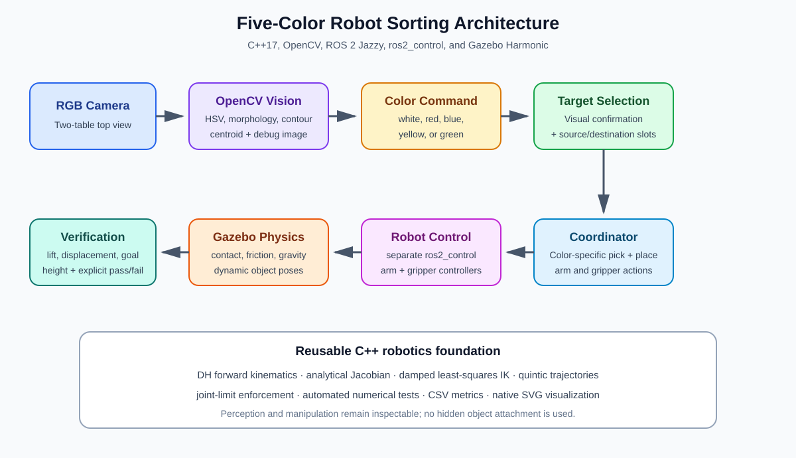
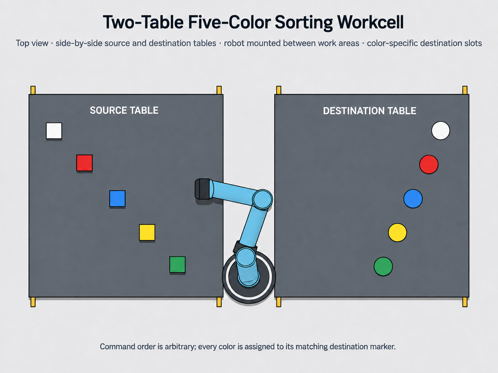

# A ROS 2 Vision-Guided Pick-and-Place Robotic Arm


*Gazebo simulation and OpenCV overhead-camera view for vision-guided, command-driven pick-and-place and five-color cube sorting.*

## C++17, ROS 2 Jazzy, OpenCV, ros2_control, and Gazebo Harmonic

This project presents a command-driven robotic manipulation system in which a
six-degree-of-freedom arm identifies and sorts five colored cubes in a Gazebo
workcell. A user selects **white, red, blue, yellow, or green** from a terminal.
An OpenCV node confirms the requested cube in an overhead RGB image, and a ROS 2
coordinator executes the corresponding pick, transfer, release, verification,
and return-home sequence.

The repository was developed as a transparent robotics and automation portfolio
project. It exposes the mathematical robotics core, perception logic, ROS 2
interfaces, controller configuration, simulation model, state machine, tests,
and validation criteria instead of presenting the system as a black box.

> **Current scope:** classical computer vision with calibrated workcell slots
> and predefined, color-specific joint-space motion profiles. Deep learning,
> arbitrary object-pose estimation, MoveIt 2 planning, and physical-robot
> deployment are documented as future work, not as completed features.





*Top-view workcell layout showing the source table, destination table, and the robot mounted between the two work areas. Color order on both tables: white, red, blue, yellow, and green.*

## Why this project matters

The project demonstrates an end-to-end robotics pipeline rather than an isolated
algorithm:

- mathematical modeling of a 6-DOF serial manipulator
- forward kinematics, Jacobian computation, and numerical inverse kinematics
- smooth quintic joint-trajectory generation
- command-conditioned computer vision in C++
- independent arm and gripper control through `ros2_control`
- Gazebo rigid-body simulation and object-pose feedback
- sequential task execution, recovery behavior, and automatic result checks
- repeatable build and test workflows for ROS 2 Jazzy

These components are relevant to graduate study in robotics, autonomous systems,
control, computer vision, and industrial automation.

## Key capabilities

- **Five selectable objects:** white, red, blue, yellow, and green cubes
- **Terminal command interface:** validated C++ utility for selecting a color
- **OpenCV perception:** HSV segmentation, morphological filtering, contour
  selection, centroid extraction, and annotated debug images
- **Two-table workcell:** equal `0.44 m × 0.44 m` source and destination tables
  with the robot installed between them
- **6-DOF arm control:** separate trajectory controller for six revolute joints
- **Independent gripper control:** separate controller for two prismatic fingers
- **Color-specific motion:** distinct source-transit, transfer, and placement
  wrist configurations for the five colors
- **Safe manipulation sequence:** approach, descend, simulated grasp attachment,
  gripper closure, lift, transfer, align, lower, detach, release, retreat, and return home
- **Grasp stabilization:** color-specific Gazebo DetachableJoint topics
- **Verification:** lift confirmation and final cube-pose acceptance checks
- **Continuous operation:** after a successful cycle, the coordinator returns
  home and waits for the next color command
- **Presentation views:** front-oriented Gazebo interface and optional annotated
  overhead-camera window

## System workflow

```text
Color command
    ↓
Overhead RGB image
    ↓
OpenCV HSV segmentation and requested-color selection
    ↓
Calibrated source pose publication
    ↓
Color-specific arm approach and pre-grasp
    ↓
Simulated grasp attachment, followed by gripper closure
    ↓
Lift verification
    ↓
Color-specific transfer and wrist alignment
    ↓
Low release at the matching destination
    ↓
Final pose verification
    ↓
Safe home return
    ↓
Wait for the next command
```

## Software stack

| Layer | Technology | Role |
| --- | --- | --- |
| Language | C++17 | Robotics core, perception, command utility, and coordinator |
| Middleware | ROS 2 Jazzy | Nodes, topics, parameters, launch, and actions |
| Simulation | Gazebo Harmonic / Gazebo Sim 8 | Robot, workcell, camera, contacts, and object feedback |
| Vision | OpenCV and `cv_bridge` | Color segmentation and annotated images |
| Control | `ros2_control` | Joint-state, arm, and gripper controller integration |
| ROS-Gazebo integration | `ros_gz_sim`, `ros_gz_bridge`, `ros_gz_image` | Simulation launch, topic bridges, and camera transport |
| Robot description | URDF and Xacro | Links, joints, inertial properties, visuals, and control interfaces |
| World description | SDF | Tables, cubes, lighting, camera, and Gazebo plugins |
| Build system | Ament CMake and colcon | Package build, installation, and testing |

## ROS 2 architecture

| Component | Responsibility |
| --- | --- |
| `color_command` | Validates and publishes the requested color |
| `color_cube_vision_node` | Detects the requested color and publishes its calibrated pose |
| `gazebo_pick_place_coordinator` | Runs the manipulation state machine and verifies the result |
| `robot_state_publisher` | Publishes the robot model and TF tree |
| `arm_controller` | Executes six-joint arm trajectories |
| `gripper_controller` | Executes two-finger gripper trajectories |
| `joint_state_broadcaster` | Publishes simulated joint states |
| `ros_gz_image` | Bridges the overhead Gazebo image into ROS 2 |
| `ros_gz_bridge` | Bridges clock, object poses, and grasp-control topics |

## Repository layout

```text
ros2-vision-guided-robot-arm-color-sorting-robot/
├── config/                         Controller and Gazebo GUI configuration
├── include/                        Robotics math, IK, model, and planner APIs
├── launch/                         Gazebo and RViz launch files
├── media/                          Architecture and workcell figures
├── meshes/                         Experimental visual-design assets
├── results/                        Numerical metrics, CSV data, and plots
├── rviz/                           RViz configuration
├── src/                            C++ implementations and ROS 2 nodes
├── tests/                          Numerical C++ test suite
├── tools/                          Reproducible mesh-generation utility
├── urdf/                           Robot URDF and Gazebo Xacro
├── worlds/                         Gazebo two-table sorting workcell
├── CMakeLists.txt
├── package.xml
├── PROJECT_REPORT.md
└── README.md
```

The files under `meshes/` are retained as experimental design resources. The
current verified Gazebo Xacro uses the stable educational arm geometry and does
not load those STL shells.

## Requirements

### Supported environment

- Ubuntu 24.04 LTS
- ROS 2 Jazzy Jalisco
- Gazebo Harmonic packages distributed for ROS 2 Jazzy
- A desktop session capable of displaying Gazebo and Qt windows

The project was tested in an Ubuntu/WSL setup with ROS 2 Jazzy. Native Ubuntu
24.04 is also the intended platform. Other ROS distributions may require
dependency, API, and launch-file changes.

### Main ROS dependencies

- `ament_cmake`
- `cv_bridge`
- `controller_manager`
- `gz_ros2_control`
- `joint_state_broadcaster`
- `joint_trajectory_controller`
- `rclcpp` and `rclcpp_action`
- `robot_state_publisher`
- `ros_gz_bridge`
- `ros_gz_image`
- `ros_gz_sim`
- `rqt_image_view`
- `xacro`

## Complete workflow from a GitHub ZIP download

This section is the copy-and-paste workflow for a new user who downloads the
repository from GitHub. It covers the complete process from an empty workspace
to a running simulation.

### 1. Install ROS 2 Jazzy and project tools

Use Ubuntu 24.04 and install ROS 2 Jazzy Desktop from the official guide:

<https://docs.ros.org/en/jazzy/Installation/Ubuntu-Install-Debs.html>

After ROS 2 has been installed, run:

```bash
sudo apt update
sudo apt install -y \
  build-essential \
  cmake \
  curl \
  unzip \
  python3-colcon-common-extensions \
  python3-rosdep \
  ros-jazzy-ros-gz \
  ros-jazzy-gz-ros2-control \
  ros-jazzy-joint-trajectory-controller \
  ros-jazzy-joint-state-broadcaster \
  ros-jazzy-rqt-image-view \
  ros-jazzy-cv-bridge \
  ros-jazzy-xacro
```

### 2. Initialize rosdep

```bash
if [ ! -f /etc/ros/rosdep/sources.list.d/20-default.list ]; then
  sudo rosdep init
fi
rosdep update
```

### 3. Create a clean workspace

```bash
mkdir -p ~/robot_arm_ws/src
```

Do not keep another copy of this ROS package anywhere inside
`~/robot_arm_ws`. Backups should be stored outside the workspace.

### 4. Download the Repository from GitHub

The following commands assume that the repository is hosted at
`ruddrho/ros2-vision-guided-robot-arm-color-sorting-robot` on the `main` branch:

```bash
GITHUB_USER=ruddrho
GITHUB_REPO=ros2-vision-guided-robot-arm-color-sorting-robot
GITHUB_BRANCH=main

curl -L \
  "https://github.com/${GITHUB_USER}/${GITHUB_REPO}/archive/refs/heads/${GITHUB_BRANCH}.zip" \
  -o ~/Downloads/${GITHUB_REPO}-${GITHUB_BRANCH}.zip
```

If the repository owner, repository name, or default branch is different,
change the three variables before running `curl`.

Alternatively, use the GitHub website:

1. Open the repository.
2. Select **Code**.
3. Select **Download ZIP**.
4. Save the file in the Downloads directory.

### 5. Extract the GitHub ZIP

For an archive downloaded with the terminal command above:

```bash
unzip -q \
  ~/Downloads/${GITHUB_REPO}-${GITHUB_BRANCH}.zip \
  -d ~/robot_arm_ws/src
```

For a ZIP downloaded through a Windows browser while using WSL, first locate it:

```bash
find /mnt/c/Users -maxdepth 3 -type f \
-iname 'ros2-vision-guided-robot-arm-color-sorting-robot*.zip' \
  -printf '%T@ %p\n' 2>/dev/null \
  | sort -nr \
  | head -n 3
```

Then extract the exact path returned by the command:

```bash
unzip -q \
 '/mnt/c/Users/YOUR_WINDOWS_USERNAME/Downloads/ros2-vision-guided-robot-arm-color-sorting-robot-main.zip' \
  -d ~/robot_arm_ws/src
```

Replace `YOUR_WINDOWS_USERNAME` when using WSL.

### 6. Verify the extracted ROS package

```bash
find ~/robot_arm_ws/src -name package.xml -print
```

Exactly one `package.xml` for this project should be displayed. The extracted
directory may end in `-main`; the directory name does not affect the ROS package
name.

Confirm the package name and version:

```bash
grep -n '<name>\|<version>' \
 ~/robot_arm_ws/src/ros2-vision-guided-robot-arm-color-sorting-robot-main/package.xml
```

If the extracted directory does not end in `-main`, use the path shown by the
previous `find` command.

### 7. Install dependencies declared by the package

```bash
cd ~/robot_arm_ws
source /opt/ros/jazzy/setup.bash

rosdep install --from-paths src --ignore-src -r -y
```

The expected final line is:

```text
#All required rosdeps installed successfully
```

### 8. Build the ROS 2 package

```bash
cd ~/robot_arm_ws
source /opt/ros/jazzy/setup.bash

colcon build --symlink-install \
  --packages-select cpp_robot_arm_kinematics \
  --cmake-clean-cache
```

The expected summary is:

```text
Summary: 1 package finished
```

### 9. Run the automated tests

```bash
cd ~/robot_arm_ws
source /opt/ros/jazzy/setup.bash
source install/setup.bash

colcon test --packages-select cpp_robot_arm_kinematics
colcon test-result --verbose
```

The expected result is:

```text
Summary: 1 test, 0 errors, 0 failures, 0 skipped
```

### 10. Launch Gazebo in Terminal 1

```bash
cd ~/robot_arm_ws
source /opt/ros/jazzy/setup.bash
source install/setup.bash

ros2 launch cpp_robot_arm_kinematics gazebo_pick_place.launch.py
```

Wait until Terminal 1 displays:

```text
Starting stage: waiting_for_color_command
```

### 11. Send commands from Terminal 2

Open a second Ubuntu terminal or VS Code terminal:

```bash
source /opt/ros/jazzy/setup.bash
source ~/robot_arm_ws/install/setup.bash
```

Send one supported color:

```bash
ros2 run cpp_robot_arm_kinematics color_command blue
```

The five supported commands are:

```bash
ros2 run cpp_robot_arm_kinematics color_command white
ros2 run cpp_robot_arm_kinematics color_command red
ros2 run cpp_robot_arm_kinematics color_command blue
ros2 run cpp_robot_arm_kinematics color_command yellow
ros2 run cpp_robot_arm_kinematics color_command green
```

Send only one command at a time. After each placement, wait until the arm
returns home and Terminal 1 displays `waiting_for_color_command` again. Then
send the next color. The five colors may be commanded in any order.

An interactive command is also available:

```bash
read -p "Enter color [white/red/blue/yellow/green]: " COLOR
ros2 run cpp_robot_arm_kinematics color_command "$COLOR"
```

### 12. Stop the project

Return to Terminal 1 and press `Ctrl+C`. Wait for the ROS 2 launch processes and
Gazebo to close before exiting the terminal.

### 13. Run the same workflow in VS Code

```bash
cd ~/robot_arm_ws
code .
```

Open two integrated terminal tabs. Use the first for the launch command and the
second for color commands. The shell commands are identical to the Ubuntu
terminal commands above

## Running the project

### Terminal 1: Launch the complete simulation

```bash
cd ~/robot_arm_ws
source /opt/ros/jazzy/setup.bash
source install/setup.bash

ros2 launch cpp_robot_arm_kinematics gazebo_pick_place.launch.py
```

The launch starts:

- Gazebo with the front-oriented workcell view
- the robot-state publisher
- ROS-Gazebo topic and image bridges
- the OpenCV vision node
- the joint-state, arm, and gripper controllers
- the pick-and-place coordinator
- an annotated top-view image window

Wait until the launch terminal displays:

```text
Starting stage: waiting_for_color_command
```

Do not send a color command before this message appears.

### Terminal 2: Send a color command

Open a new Ubuntu terminal or a second VS Code terminal:

```bash
source /opt/ros/jazzy/setup.bash
source ~/robot_arm_ws/install/setup.bash

ros2 run cpp_robot_arm_kinematics color_command blue
```

Valid commands are:

```bash
ros2 run cpp_robot_arm_kinematics color_command white
ros2 run cpp_robot_arm_kinematics color_command red
ros2 run cpp_robot_arm_kinematics color_command blue
ros2 run cpp_robot_arm_kinematics color_command yellow
ros2 run cpp_robot_arm_kinematics color_command green
```

Choose any order. Send only one command at a time. Wait for the arm to place the
cube, return to its home configuration, and display
`waiting_for_color_command` before sending the next color. A color that has
already been successfully placed during the current launch is rejected.

### Disable the annotated top-view window

```bash
ros2 launch cpp_robot_arm_kinematics gazebo_pick_place.launch.py \
  use_vision_view:=false
```

### Open RViz in addition to Gazebo

```bash
ros2 launch cpp_robot_arm_kinematics gazebo_pick_place.launch.py \
  use_rviz:=true
```

### Stop the simulation

Return to Terminal 1 and press:

```text
Ctrl+C
```

Allow the launch system to stop its child processes before closing the terminal.

## Running from the VS Code terminal

VS Code does not require a different build or launch process. Open the workspace:

```bash
cd ~/robot_arm_ws
code .
```

Then use **Terminal > New Terminal** and run the same commands shown above.
Use one terminal tab for the Gazebo launch and a second terminal tab for color
commands. Every new terminal must source both environments:

```bash
source /opt/ros/jazzy/setup.bash
source ~/robot_arm_ws/install/setup.bash
```

Optional convenience setup:

```bash
echo 'source /opt/ros/jazzy/setup.bash' >> ~/.bashrc
echo 'source ~/robot_arm_ws/install/setup.bash' >> ~/.bashrc
source ~/.bashrc
```

Only add the workspace line after the project has been built successfully.

## Observing the system

### Main topics

| Topic | Message type | Purpose |
| --- | --- | --- |
| `/target_color` | `std_msgs/msg/String` | User-selected cube color |
| `/overhead_camera/image` | `sensor_msgs/msg/Image` | Gazebo overhead RGB image |
| `/vision/debug_image` | `sensor_msgs/msg/Image` | Annotated detector output |
| `/vision/status` | `std_msgs/msg/String` | Vision-node status and detection result |
| `/vision/selected_cube_pose` | `geometry_msgs/msg/PoseStamped` | Calibrated target pose after visual confirmation |
| `/pick_place_stage` | `std_msgs/msg/String` | Current state-machine stage |
| `/pick_place_success` | `std_msgs/msg/Bool` | Final automatic success result |

Useful monitoring commands:

```bash
ros2 topic echo /vision/status
ros2 topic echo /pick_place_stage
ros2 topic echo /pick_place_success
ros2 topic hz /vision/debug_image
```

Open the annotated camera manually:

```bash
ros2 run rqt_image_view rqt_image_view /vision/debug_image
```

List the main nodes:

```bash
ros2 node list --no-daemon
```

List active controllers:

```bash
ros2 control list_controllers
```

## Perception method

The C++ detector performs the following steps:

1. receives the Gazebo BGR image through `cv_bridge`
2. converts BGR to HSV
3. applies a color-specific threshold
4. combines two hue intervals for red
5. performs morphological opening and closing
6. restricts the contour search to the configured source-table region
7. rejects contours outside the configured area range
8. selects the largest valid contour
9. calculates the centroid from contour moments
10. publishes the corresponding calibrated workspace slot

This is a classical computer-vision pipeline. It does not use a neural network.
The detected centroid confirms the requested object, while the supplied slot map
provides the motion target.

## Manipulation and control method

The six revolute joints and two gripper fingers use separate
`JointTrajectoryController` action servers. The coordinator uses an elbow-up
motion branch to keep the arm clear of the tables and applies different source
and transfer configurations for each color. A dedicated placement-wrist angle
provides visible wrist motion before the low release.

The simulation sequence activates a color-specific Gazebo DetachableJoint after
the gripper reaches the calibrated grasp pose and immediately before the fingers
close. The joint stabilizes the simulated cube during transfer and is detached
at the matching destination before the gripper opens. This is a simulation aid,
not a claim of force-controlled physical grasping.

After placement, the coordinator checks:

- planar displacement greater than `0.20 m`
- destination error below `0.08 m`
- final-height error below `0.08 m`

Only a successful sequence is recorded as completed. The arm then returns to the
unchanged safe home configuration and waits for another command.

## Mathematical robotics core

The standalone C++ library implements:

- standard Denavit-Hartenberg forward kinematics
- a 6 × 6 geometric Jacobian
- damped least-squares numerical inverse kinematics
- joint-limit clamping
- quintic joint interpolation with zero endpoint velocity and acceleration

The IK update is:

```text
Δq = Jᵀ (J Jᵀ + λ²I)⁻¹ e
```

The quintic time-scaling function is:

```text
s(τ) = 10τ³ - 15τ⁴ + 6τ⁵
```

## Recorded numerical results

The supplied CSV artifacts document the standalone C++ kinematics baseline:

| Metric | Recorded value |
| --- | ---: |
| Numerical checks | 5/5 passed |
| IK targets solved | 7/7 |
| Mean IK iterations | 9.0 |
| Maximum IK position error | 0.000085653 m |
| Maximum IK orientation error | 0.000130292 rad |
| Trajectory duration | 17.5 s |
| Trajectory samples | 876 |
| Maximum joint velocity | 0.674919885 rad/s |
| Maximum joint acceleration | 0.831226056 rad/s² |

These values come from `results/summary_metrics.csv` and
`results/ik_results.csv` and represent the standalone C++ kinematics baseline.
Any earlier Gazebo single-cube artifacts are retained only as historical
development records and do not represent the final five-color system.
For a new machine or a new code revision, rebuild, rerun the tests, and record a
fresh Gazebo trial before reporting new performance values.

## Troubleshooting

### `rosdep` has not been initialized

```bash
sudo rosdep init
rosdep update
```

If `20-default.list` already exists, do not run `sudo rosdep init` again. Run
only `rosdep update`.

### `Package 'cpp_robot_arm_kinematics' not found`

```bash
source /opt/ros/jazzy/setup.bash
source ~/robot_arm_ws/install/setup.bash
ros2 pkg prefix cpp_robot_arm_kinematics
```

If the prefix command fails, rebuild the workspace.

### Duplicate package names

Check the workspace:

```bash
find ~/robot_arm_ws -name package.xml -print
```

Keep only one copy of `cpp_robot_arm_kinematics` inside the workspace. Store
backups outside `~/robot_arm_ws`.

### Gazebo opens but the robot does not move

Confirm that both controllers are active:

```bash
ros2 control list_controllers
```

Wait for `waiting_for_color_command` before sending a command. Also verify that
the command terminal sourced the workspace setup file.

### No overhead-camera image in ROS 2

Check both Gazebo and ROS topics:

```bash
gz topic -l | grep overhead_camera
ros2 topic info /overhead_camera/image --verbose --no-daemon
```

The ROS topic must have an image publisher and the vision node must appear as a
subscriber.

### Blank annotated image

```bash
ros2 topic hz /vision/debug_image
ros2 topic echo /vision/status --once \
  --qos-durability transient_local \
  --qos-reliability reliable
```

Confirm that the Gazebo simulation is running rather than paused.

### Gazebo interface or camera view is incorrect

The project uses:

```text
config/front_view_gui.config
```

The launch file passes this configuration with `--gui-config`. Rebuild after
editing the file so the installed package contains the update.

### Gazebo or ROS discovery remains active after closing a terminal

First stop the launch with `Ctrl+C`. Inspect remaining processes without
deleting workspace files:

```bash
ps -ef | grep -E '[g]z sim|[c]olor_cube_vision|[i]mage_bridge'
ros2 node list --no-daemon
```

Start a fresh launch only after the previous simulation processes have stopped.

## Scope and limitations

- The detector uses HSV color segmentation, not deep learning.
- Object targets come from calibrated slots, not arbitrary 3D pose estimation.
- Source positions, thresholds, camera pose, and lighting are configured for the
  supplied workcell.
- Motion profiles are predefined and are not generated by an online,
  collision-aware planner.
- The project does not currently use MoveIt 2.
- DetachableJoint stabilizes simulated grasps and does not model hardware grasp
  force or tactile feedback.
- Dynamics and actuator parameters are educational rather than identified from
  physical hardware.
- Results from simulation do not establish physical-robot accuracy or safety.

## Future work

The present version is intentionally retained as a stable classical-vision
baseline. The following extensions form a structured research roadmap.

### 1. Deep-learning perception

- collect and annotate a multi-condition object dataset
- train an object detector for color, shape, and object-class recognition
- export the model to ONNX
- integrate C++ inference through ONNX Runtime or OpenCV DNN
- compare the learned model with the HSV baseline using precision, recall,
  inference latency, and robustness under lighting changes and occlusion

### 2. Dynamic object localization

- calibrate camera intrinsic and extrinsic parameters
- transform image detections into the robot base frame with TF2
- support arbitrary object positions instead of fixed source slots
- add RGB-D sensing or calibrated table-plane projection
- estimate object orientation for grasp alignment

### 3. Collision-aware manipulation

- integrate MoveIt 2
- use inverse kinematics and Cartesian approach paths online
- represent both tables, cubes, and the robot in a planning scene
- check self-collision, table collision, and joint limits before execution
- replan when the scene changes

### 4. Grasping and recovery

- generate grasp candidates from object pose and geometry
- add contact, force, or tactile feedback on physical hardware
- implement automatic re-detection and retry after a failed grasp
- classify failure modes and log recovery outcomes

### 5. Experimental evaluation

- randomize cube positions and lighting conditions
- repeat each scenario over multiple trials
- report pick success rate, placement error, cycle time, detection latency, and
  recovery rate with transparent sample counts
- store ROS bags and test datasets for reproducibility

### 6. Physical deployment

- transfer the ROS 2 interfaces to a supported 6-DOF manipulator
- calibrate the real camera, gripper, dynamics, and safety limits
- add emergency-stop, workspace monitoring, and hardware-aware fault handling
- compare simulation and physical-system performance

## Suggested academic description

> A ROS 2 Jazzy and Gazebo-based vision-guided sorting manipulator that combines
> a from-scratch C++ robotics core, OpenCV color recognition, independent
> ros2_control arm and gripper execution, color-specific joint-space motion,
> simulated grasp stabilization, and automatic object-pose verification.

This wording accurately describes the completed work without claiming deep
learning, general object-pose estimation, MoveIt 2 planning, or real-hardware
validation.

## Further documentation

- [Technical project report](PROJECT_REPORT.md)
- [Version history](CHANGELOG.md)
- [Controller configuration](config/gazebo_controllers.yaml)
- [Robot Xacro](urdf/educational_6dof_arm_gazebo.urdf.xacro)
- [Gazebo world](worlds/pick_place.sdf)

## License

This project is released under the MIT License. See [LICENSE](LICENSE).

## Author

**Ruddrho Mollik**  
Robotics and automation portfolio project
